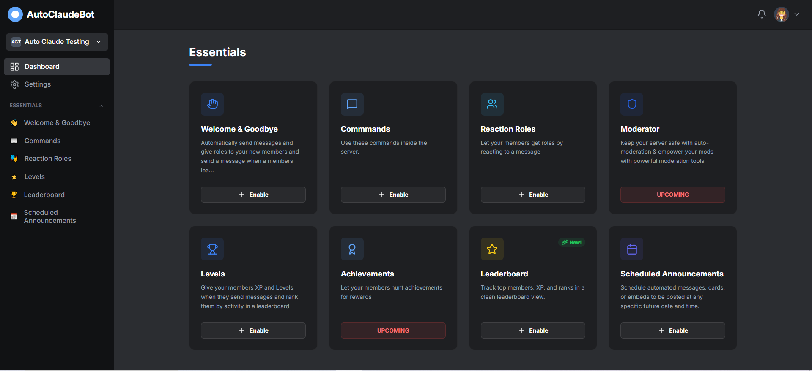

# AutoClaude

AutoClaude is a self-hosted Discord bot + web dashboard that bundles server management, automation, and leveling features into a single local app. It runs a lightweight FastAPI backend, Discord clients for features, and a local web UI that talks to the backend over HTTP.

This repository contains the GitHub-ready copy of the project under `AutoClaude`.

---

## Key Features

*  **XP & Leveling System**
     - Members earn XP for activity (chatting, helping others, participating in discussions).
     - Progression system similar to Skool.com or MEE6.
     - Unlock recognition or roles as levels increase.
     - Ability to customize through tens of different settings.
     - Update the database with the old server messages.

 *  **Leaderboard**
     - Track and display top contributors.
     - Support for multiple views: Weekly, Monthly, and All-time.
     - To be used for future giveaways and community recognition.

*   **Welcome & Goodbye messages**:
     - Automated greeting for new members.
     - Send Private Message to the User when he joins the server.
     - Automatically give a new role to new users.
     - Send a message when a user leaves the server.
*   **Role Assignment (Emoji-based) and (dropdown-based)**: Self-signing roles via reactions (as seen in `#assign-role`).
*   **Scheduling/Office Hours**: Announcements for upcoming events or office hours.
*   **Stats & Analytics**: Insights into community growth and engagement.
*   **Commands for Discord Server**: 
     - /Analytics Member: See members for each role, and total members
     - /Github: Access any file inside AutoClaude Github.
     - /Level: See your level and XP.
     - /Leaderboard: See the LeaderBoard for any category.
*   **Creative Additions**: 
     - Integration with Github API, Use **/leaderboard** command to access any file iside AutoClaude Github.
     - Automatic HI emojji whenver a person in the server says hi or hello in any form
     - 
*   AutoClaudeBot prioritizes UI/UX for server admins. Every feature has a beautiful dashboard. No typing commands to configure—just click, design, and save.

*   This App does not contain any discord feature, which already exists inside Discord. It fulfills the all the requirements of **K MEMBERS GIVEAWAY — Build the Auto Claude Community Bot! **.

*  **Future**:
    - This App does not contain any other features than the above mentioned features. But this code is designed to be easily updated and vibe coded.
    - You can add or create any feature inside this app in just a few minutes, with the perfect structure and file system. See **File Structure.md**.
    - This contains the template and the prompts required to vibe code this app, and add new features every few minutes.

---

## What It Does

AutoClaude provides a MEE6-style feature set with a locally hosted GUI for configuration. The core workflow is:

1. Start the backend server.
2. Open the web dashboard.
3. Configure features per server (token, channels, roles, toggles, and settings).
4. The Discord bot executes those features in real time.

---

## Requirements

- Python 3.11+ (tested with 3.13)
- Discord bot token

---

## Setup

- Follow the Instruction of **[Scripts.md](./Installation.md)**.

---

## Using the Dashboard

- **Dashboard**: entry point to all features.
- **Settings**: token + emoji reaction settings.
- **Welcome/Goodbye**: configure greetings and join roles.
- **Reaction Roles**: create emoji ? role mappings.
- **Commands**: role-based permissions for slash commands.
- **Levels**: XP settings, no-XP zones, role rewards, rank card preview.
- **Leaderboard**: prototype command UI (Testing folder).
- **Scheduled Annocument** - Announcements for upcoming events or office hours.

---

## Database Files

- `AutoClaude.db` � persistent settings.
- `Message_Database.db` � message history and analytics.

Both are created and managed automatically.

---

## Security Notes

- The token is stored locally in a database.
- Do not commit your token to public repositories.
- Use `.gitignore` to exclude local DB files.

---

## License

This project is intended for open-source release. Anyone Can use it and edit it.

---

