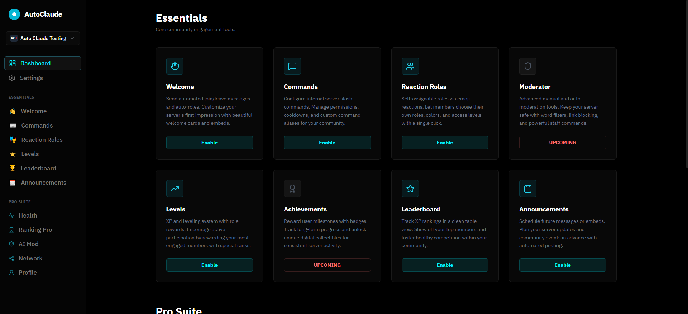

# AutoClaude

AutoClaude is a self-hosted Discord bot + web dashboard that bundles server management, automation, and leveling features into a single local app. It runs a lightweight FastAPI backend, Discord clients for features, and a local web UI that talks to the backend over HTTP.

This repository contains the GitHub-ready copy of the project under `AutoClaude`.

---

## Key Features

* **XP & Leveling System** - Members earn XP for activity (chatting, helping others). Progression similar to Skool.com or MEE6. Unlock recognition or roles as levels increase. Customizable through tens of settings. Update database with old server messages.

* **Leaderboard** - Track and display top contributors. Multiple views: Weekly, Monthly, All-time. For future giveaways and community recognition.

* **Welcome & Goodbye Messages** - Automated greeting for new members. Send Private Message to users on join. Automatically assign new member role. Send message when users leave.

* **Role Assignment** - Emoji-based and dropdown-based self-signing roles via reactions (as seen in `#assign-role`).

* **Scheduling/Office Hours** - Announcements for upcoming events or office hours.

* **Stats & Analytics** - Insights into community growth and engagement.

* **Commands for Discord Server:**
  - `/analytics member` - See members for each role and total members
  - `/github` - Access any file inside AutoClaude Github
  - `/level` - See your level and XP
  - `/leaderboard` - See the LeaderBoard for any category

* **Creative Additions:**
  - GitHub API integration - Use `/leaderboard` command to access files inside AutoClaude Github
  - Automatic "HI" emoji when a person in the server says hi or hello in any form

* **Beautiful Dashboard** - AutoClaudeBot prioritizes UI/UX for server admins. Every feature has a beautiful dashboard. No typing commands—just click, design, and save.

---

## 50+ Commands

**Moderation & Safety:** `/moderation` (add/remove/list), `/punish` (ban/kick/warn/mute), `/punishment list` – **Leveling & Engagement:** `/xp` (rank/leaderboard/add/remove), `/quests` (list/claim), `/achievements`, `/thank`, `/level-reward` (set/remove/list) – **Utility & Search:** `/search` (DuckDuckGo), `/ping`, `/help`, `/help-admin`, `/poll` (create/close), `/profile` – **System & Roles:** `/ticket` (open/close/setup), `/autorole` (set/remove), `/role` (add/remove/list), `/role-config`, `/afk` (set/clear), `/reputation` – **Events:** `/events list`, `/event` (create/cancel), `/leaderboard`, `/leaderboard-post`, `/backup`, `/health-check`, `/analytics member`, `/github` – **Additional:** `/giveaway-export`, auto "hi" emoji reactions.

---

## 5 New Pro Dashboards

* **Health Analytics** - Server health monitoring with Chart.js (24h/7d/30d views)
* **Network Graph** - D3.js interactive social interaction visualization
* **Moderation Pro** - AI triage system with blocklist enforcement & violation logging
* **Leaderboard Pro** - Time-sliced rankings (Daily/Weekly/Monthly/All-Time)
* **Profile Pro** - Member identity cards with 42-day activity heatmap + badges

---

## Using the Dashboard

* **Dashboard** - Entry point to all features
* **Settings** - Token + emoji reaction settings
* **Welcome/Goodbye** - Configure greetings and join roles
* **Reaction Roles** - Create emoji/dropdown role mappings
* **Commands** - Role-based permissions for slash commands
* **Levels** - XP settings, no-XP zones, role rewards, rank card preview
* **Leaderboard** - Query builder UI with time-sliced rankings
* **Scheduled Announcements** - Announcements for upcoming events or office hours
* **Health Analytics** - Server health monitoring dashboard
* **Network Graph** - Social interaction visualization
* **Moderation Pro** - Rule management and AI triage
* **Profile Pro** - Member intelligence cards

---

## What It Does

AutoClaude provides a MEE6-style feature set with a locally hosted GUI for configuration. The core workflow is:

1. Start the backend server.
2. Open the web dashboard.
3. Configure features per server (token, channels, roles, toggles, and settings).
4. The Discord bot executes those features in real time.

---

## Requirements

- Python 3.11+ (tested with 3.13)
- Discord bot token

---

## Setup

1. Install dependencies: `pip install -r requirements.txt`
2. Run: `python Start.py`
3. Dashboard opens automatically
4. Input bot token in Settings
5. Select server and configure features

---

## Database Files

* `AutoClaude.db` – Persistent settings
* `Message_Database.db` – Message history and analytics

Both are created and managed automatically.

---

## Security Notes

* The token is stored locally in a database
* Do not commit your token to public repositories
* Use `.gitignore` to exclude local DB files
* All data stays on your machine

---

## Future

This code is designed to be easily updated and vibe coded. You can add or create any feature inside this app in just a few minutes, with the perfect structure and file system. See **File Structure.md**. This contains the template and prompts required to vibe code this app and add new features every few minutes.

---

## License

This project is intended for open-source release. Anyone can use it and edit it.

---
